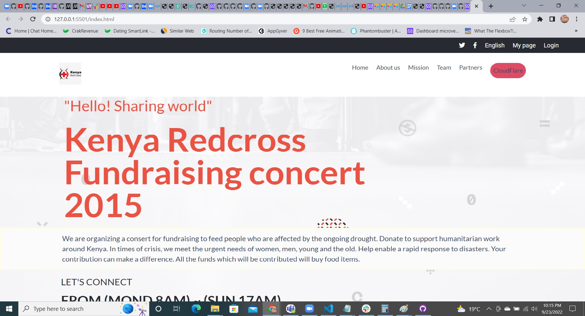

# A Website For Kenya Redcross Fundraising concert

> This is a capstone project where I develop a website for Fundraising concert.
> This project includes :
✔ The home page
✔ The about page

## Built With

- HTML, CSS, Javascript and Bootstrap

Screenshot;

## Live Demo
> [Link to project] 

## Getting Started

To get a local copy up and running follow these simple example steps.

✔ Clone the repo to your local environment
✔ Run npm install to install all dependencies
✔ Open the index.html file with your favorite browser.
✔ Modify with your preferred text editor

## Authors

👤 **Harrison Njuguna**
👍**Github @Harrynoqs**

## 🤝 Contributing

Contributions, issues, and feature requests are welcome!

Feel free to check the [issues page].

## Acknowledgments

- [Cindy Shin in Behance](https://www.behance.net/adagio07)
- [Fontawesome](https://fontawesome.com/icons)
- Kenya red cross for the use of its logo.

## 📝 License

This project is [MIT](./LICENSE) licensed.